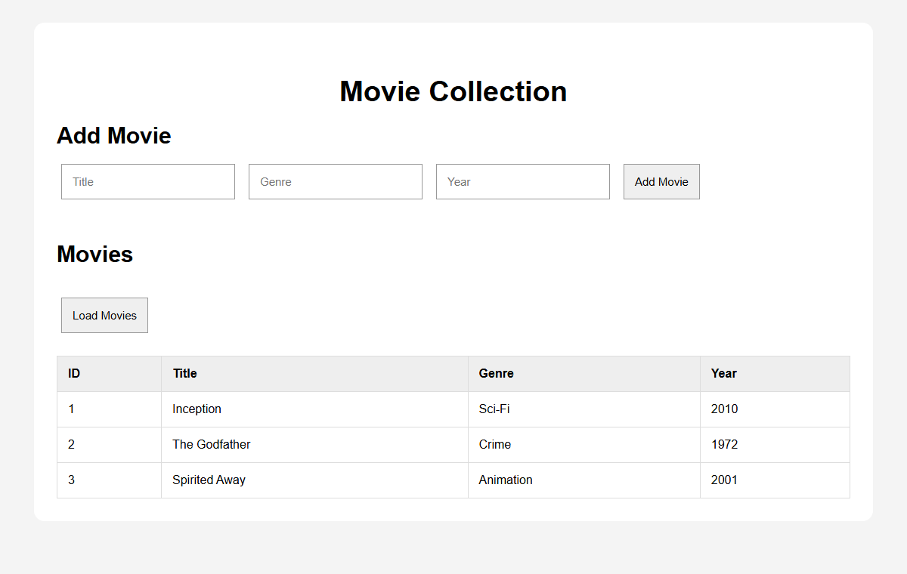

# Movie Collection REST API

A simple Movie Collection REST API built with **Node.js** and **Express**, with a plain HTML frontend that talks to the API using `fetch()`.

**Course:** IT3206N



## Features

- Retrieve all movies or a single movie by ID
- Add a new movie with an automatically assigned ID
- Validation that returns an error when required fields are missing
- Frontend page that lists movies, adds a movie through a form, and refreshes the list after each addition

> **Note:** This project uses **no database**. Movies are stored in a JavaScript array in memory, so any added records **disappear when the server restarts**.

### Installation and Running

```bash
# 1. Clone the repository
git clone https://github.com/BreakableEggshell/IT3206N-Movie-API.git
cd IT3206N-Movie-API

# 2. Install dependencies
npm install

# 3. Start the server
npm start
```

The server runs at **http://localhost:3000**. Open that address in a browser to use the frontend.

## Movie Object

| Field   | Type   | Description                              |
| ------- | ------ | ---------------------------------------- |
| `id`    | number | Assigned automatically by the server     |
| `title` | string | Title of the movie (required)            |
| `genre` | string | Genre of the movie (required)            |
| `year`  | number | Year the movie was released (required)   |

## API Endpoints

| Method | Endpoint          | Description            |
| ------ | ----------------- | ---------------------- |
| GET    | `/api/movies`     | Retrieve all movies    |
| GET    | `/api/movies/:id` | Retrieve one movie     |
| POST   | `/api/movies`     | Add a new movie        |